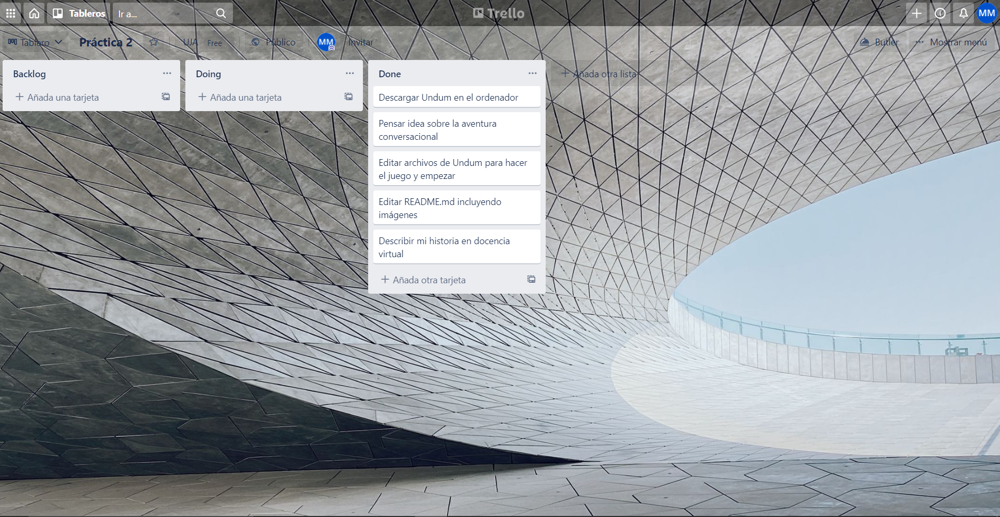

# En Busca Del Pollo

En Busca Del Pollo es un juego conversacional hecho con Undum que trata sobre una mañana en mi vida
en la que tengo que comprar pollo para poder comer. Tras terminar las clases de la universidad, tenemos 
que comprar la comida de hoy y para ello tendremos que seleccionar las mejores opciones para poder traerlo 
a casa.

Para saber si hemos conseguido el pollo al final de la partida, en el inventario del personaje sale el pollo
junto con su imagen si lo hemos podido comprar y traer a casa o no aparecerá nada si no conseguimos traerlo
a casa.

Para jugar simplemente abriremos el archivo tutorial.en.html y listo.

## URL Del Tablero Trello

El enlace al tablero de esta práctica es [este](https://trello.com/b/TTZijFkC/pr%C3%A1ctica-2).

## Capturas De Pantalla Del Tablero En Trello

A lo largo de la práctica, se va tocando el tablero añadiendo tareas nuevas, moviéndolas de una lista a otra según las vayas realizando o incluso borrándolas.

A continuación veremos las capturas del proceso del tablero desde que se crean las primeras tareas hasta que se termina la practica:

1. Inicio de la práctica

2. Desarrollo de la práctica

3. Final de la práctica

## Capturas De Pantalla De La Aplicación Telegram

Aquí veremos las capturas de pantalla pertenecientes a la vinculación de eventos en GitHub con Telegram
y también de Trello:

1. Vinculación de GitHub con Telegram

2. Vinculación de Trello con Telegram

## Licencia

El código, la documentación, los estilos, el diseño y las imágenes se distribuyen
bajo la licencia MIT. Esto le permite modificarlos y utilizarlos, incluso
para uso comercial. Una copia de la licencia MIT se encuentra en el archivo LICENSE
del archivo.
